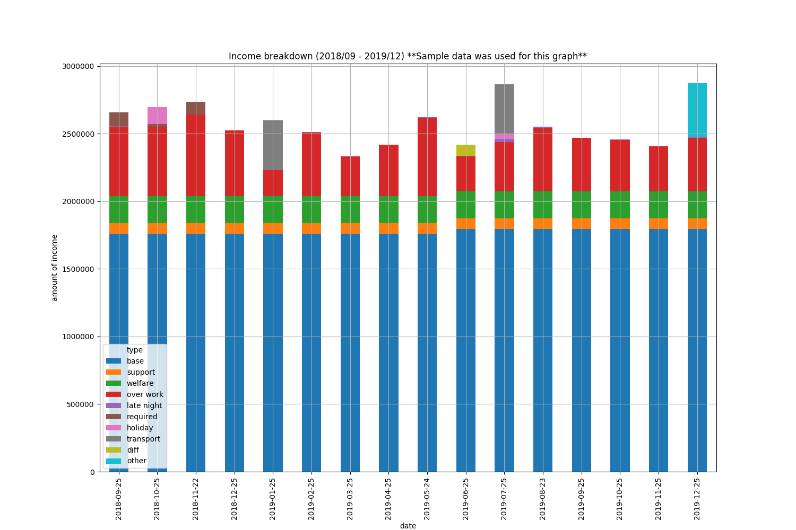

# PaycheckGraph

<!-- ##### Analyse your paycheck -->

[](https://shields.io/)
[](https://shields.io/)



<!-- Put Sample Image Here -->
## Getting Started

**Update(February 5, 2020)**: Paycheck at where I work is published by a PDF file. Just reading them, might be enough for checking erros, but do you not want to see *trends* over time?

This package creates statical graphs of your paycheck! Download it and try putting your pdf file in the suggested folder where instructed below.

*NOTICE: This package only works at the company where I work.*

### Prerequisites
* Paycheck downloaded (in pdf format). <br>
*/// Again, this package only works at the company where I work. ///*


### Installing
Install MongoDB to your local environment.
<br>See
[The Official MongoDB Software Homebrew Tap](https://github.com/mongodb/homebrew-brew).

Git clone this repository.
```bash
$ git clone https://github.com/yoshiki-11/paycheck_analytics.git
```

Pip install *requirements.txt*.
```bash
$ pip install requirements.txt
```

## Running the test
### Analyse your data
Set your pdf files at `data/pdf`.

Run <br>
```bash
$ python main.py
```
Follow the dialog accordingly.

### Check your graph
If application runs successfully, the graph would be outputted at `data/output/graphs_and_charts`.


## Built With
* [pdfminor.six](https://github.com/pdfminer/pdfminer.six) - Used to extract text from pdf files.
* [MongoDB](https://github.com/mongodb/mongo) - Database used.

